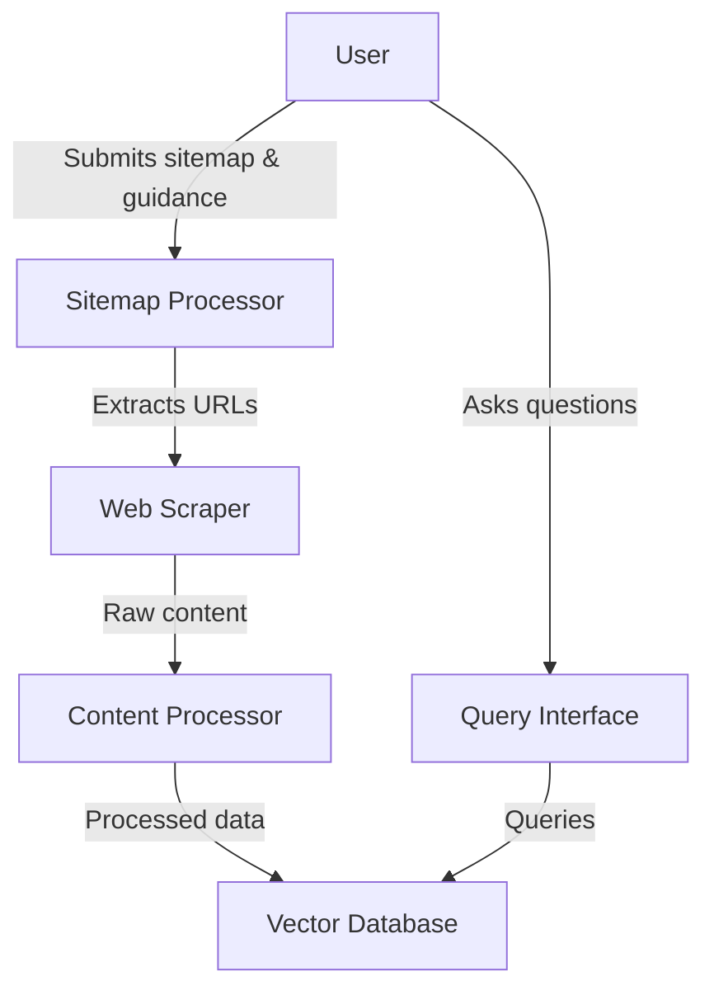

# Simplified Documentation Service Design

Below is a diagram of our simplified documentation service design:

## Component Descriptions

1. **Sitemap Processor**: Accepts a sitemap file and user guidance to determine which links to scrape.
2. **Web Scraper**: Fetches content from the URLs provided by the Sitemap Processor.
3. **Content Processor**: Extracts relevant information from the raw HTML and prepares it for storage.
4. **Vector Database**: Stores the processed content in a format that allows for semantic searching.
5. **Query Interface**: Allows users to ask questions about the stored documentation.

This design provides a streamlined approach to ingesting documentation, storing it efficiently, and allowing users to query it directly.
